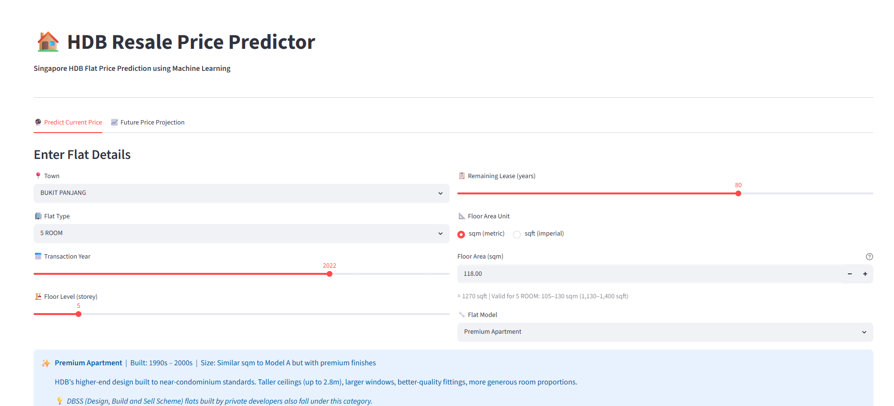
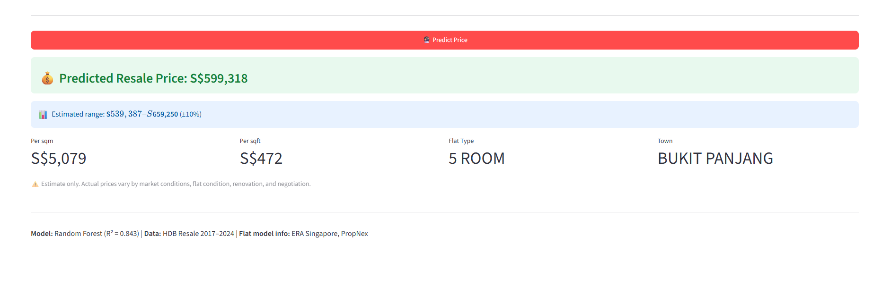
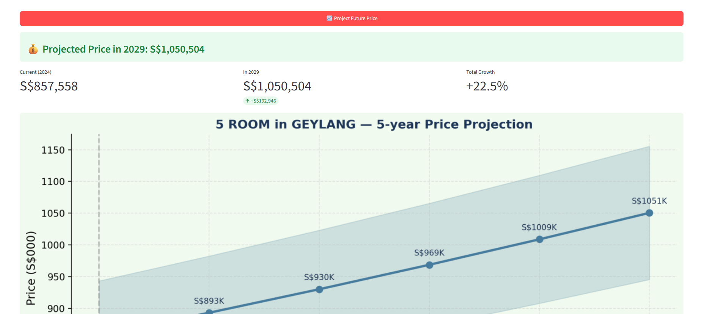

# 🏠 HDB Resale Price Prediction — Singapore
### Can AI predict HDB resale prices? Yes — with 84.3% accuracy.

This machine learning project analyses Singapore HDB resale transaction data from 2017–2024, trains two predictive models, and serves predictions through an interactive web app built with Streamlit.

---

## Project Explanation

The HDB Resale Price Prediction project represents how I approach self-directed learning. Rather than following a fixed tutorial or copying code from existing sources, I used AI as a collaborative tool to scope the problem myself, asking targeted questions, debugging errors, and pushing for improvements like input validation and future price projection. The prompts I wrote required me to think like a developer: what data do I need, what can go wrong, and what does the user actually need to see. The result is a project I can walk through end-to-end and explain every decision in, from why we use Label Encoding for categorical variables, to why Random Forest outperforms Linear Regression on this dataset, to why an MAE of S$68,844 is meaningful in the context of Singapore's property market.

As AI continues to evolve, the ability to code every line manually matters less than understanding the logic behind what you are building. A developer who can clearly define a problem, break it into steps, and direct AI toward the right solution is more valuable than one who simply writes syntax. This project reflects that belief. I did not just prompt for working code, I prompted for specific features I knew users would need, like future price projection, because I thought about the problem from a user's perspective. That instinct came from a personal place. I started this project wanting to learn machine learning, but also wanting a concrete estimate of where HDB prices might be in ten years so I could begin planning my own finances. The best projects, I have found, are the ones where you are also the user.

## 📸 Screenshots

**Input Form**


**Prediction Result**


**5-Year Price Projection**


---

## 📌 Project Summary

| Item | Detail |
|------|--------|
| **Goal** | Predict HDB resale prices using machine learning |
| **Data** | 8,000 HDB resale transactions, 2017–2024 (data.gov.sg) |
| **Towns covered** | 24 HDB towns across Singapore |
| **Price range in data** | S$202,000 – S$2,014,000 |
| **Best model** | Random Forest Regressor |
| **Accuracy (R²)** | 0.843 — explains 84.3% of price variation |
| **Average error (MAE)** | S$68,844 per prediction |
| **Web app** | Streamlit — runs locally in your browser |

---

## 🗂️ Project Structure

```
hdb_project/
│
├── data/
│   └── hdb.csv                   ← HDB resale transaction data (from data.gov.sg)
│
├── src/
│   ├── 01_load_data.py           ← Step 1: Load CSV, inspect columns and data types
│   ├── 02_eda.py                 ← Step 2: Analyse price patterns by town, flat type, year
│   ├── 03_visualise.py           ← Step 3: Generate charts (distribution, trends, scatter)
│   ├── 04_train_model.py         ← Step 4: Train Linear Regression + Random Forest models
│   ├── app.py                    ← Step 5: Streamlit web app for live predictions
│
├── models/
│   └── rf_model.pkl              ← Saved trained Random Forest model
│
├── outputs                     ← All generated chart images
│
└── README.md                     ← This file
```

---

## 🚀 How to Run

### 1 — Install dependencies
```bash
pip install pandas matplotlib seaborn scikit-learn streamlit
```

### 2 — Add your data
Download the HDB resale flat prices dataset from [data.gov.sg](https://data.gov.sg) and place it at:
```
data/hdb.csv
```

### 3 — Run each step in order
```bash
python src/01_load_data.py        # Inspect the dataset
python src/02_eda.py              # Analyse price patterns
python src/03_visualise.py        # Generate charts
python src/04_train_model.py      # Train and save models
```

### 4 — Launch the web app
```bash
python -m streamlit run src/app.py
```
Open **http://localhost:8501** in your browser.

---

## 🧠 How the Project Works 

### Step 1: Load the Data
We load a CSV file of real HDB resale transactions. Each row is one transaction and contains details like the town, flat type, floor area, floor level, remaining lease, and the price it sold for. We check for missing values and understand the shape of the data before doing anything else.

### Step 2: Exploratory Data Analysis (EDA)
Before building any model, we ask questions of the data:
- Which towns are the most expensive?
- Do higher floors cost more?
- How much does floor area affect price?
- Has the market gone up over the years?

This step builds our human understanding of what drives HDB prices — which makes us better at choosing the right features for the model.

### Step 3: Visualisation
We turn the numbers into charts. Key charts include:
- **Price distribution** — most flats cluster between S$400K and S$800K
- **Price by town** — Central Area and Bukit Timah are significantly more expensive
- **Floor area vs price** — a clear upward trend; bigger = pricier
- **Price trend over time** — HDB prices rose sharply from 2020 onwards
- **Storey heatmap** — higher floors command a measurable premium across all flat types

### Step 4: Feature Engineering
Raw data has columns like `"remaining_lease": "65 years"` — the model cannot use text directly. We extract the number (65) and convert everything into numeric format. We also encode categorical columns like `town` and `flat_type` into numbers using Label Encoding.

**Features used to predict price:**

| Feature | Why it matters |
|---------|---------------|
| `floor_area_sqm` | Bigger flat = higher price |
| `storey_mid` | Higher floor = premium view = higher price |
| `remaining_lease_years` | Longer lease = more valuable |
| `year` | Market prices rise over time |
| `town` (encoded) | Location is the single biggest price factor |
| `flat_type` (encoded) | 5-room costs more than 3-room |
| `flat_model` (encoded) | Premium Apartment > Standard design |

### Step 5: Machine Learning Models

We train two models and compare them:

**Model 1 — Linear Regression**
Assumes price is a straight-line combination of all features. Simple and fast, but cannot capture complex non-linear relationships (e.g. the price jump for very high floors, or how a Premium Apartment in Bishan behaves differently from one in Woodlands).

**Model 2 — Random Forest**
Builds 200 decision trees, each trained on a random subset of the data. Each tree makes its own prediction and the final answer is the average across all 200 trees. This approach handles non-linear relationships, interactions between features, and outliers far better than Linear Regression.

### Step 6: Evaluation
We never test the model on data it was trained on — that would be cheating. Instead, 20% of the data is held back as a test set the model has never seen. We measure:

- **MAE (Mean Absolute Error)** — the average S$ amount the prediction is wrong by
- **R² Score** — what percentage of real price variation the model can explain

### Step 7: Web App
The trained model is saved to a `.pkl` file and loaded by a Streamlit web app. Users enter flat details through a form and receive an instant predicted price, a ±10% confidence range, and a price-per-sqm/sqft breakdown. A second tab projects the price up to 15 years into the future using historical HDB growth rates.

---

## 📊 Model Results

| Model | MAE | R² Score | Verdict |
|-------|-----|----------|---------|
| Linear Regression | S$98,494 | 0.686 | Good baseline |
| **Random Forest** | **S$68,844** | **0.843** | **Best model** |

**What does MAE of S$68,844 mean in real life?**
If a flat actually sells for S$600,000, the model's prediction will typically land somewhere between S$531,000 and S$669,000. For a property market as varied as Singapore's, this is strong performance.

**What does R² = 0.843 mean?**
84.3% of the reason prices differ between flats is explained by the 7 features we fed the model. The remaining 15.7% comes from factors not in the dataset — renovation quality, specific block orientation, proximity to amenities, and negotiation.

**Why is Random Forest better than Linear Regression?**
HDB prices do not behave linearly. A flat on the 30th floor is not exactly twice as expensive as one on the 15th floor. A flat in Bishan does not cost exactly S$X more than one in Yishun regardless of other factors. Random Forest captures these non-linear, context-dependent relationships because each decision tree learns its own branching rules from the data.

---

## 🌐 Web App Features

- **Live price prediction** — enter flat details, get an instant S$ estimate
- **sqm / sqft toggle** — switch units without re-entering data
- **Input validation** — floor area limits enforced per flat type (e.g. 2-room cannot be 150 sqm)
- **Flat model explainer** — each model type explained with era, typical size, and notes
- **Future price projection** — projects price up to 15 years ahead with a chart
- **Confidence range** — every prediction includes a ±10% estimated range

---

## 📈 Key Findings

1. **Location is the strongest price driver** — Central Area flats average ~70% more than Woodlands flats of the same type and size
2. **Floor area and flat type together explain most of the price** — these two features alone account for the majority of the model's predictive power
3. **HDB prices rose ~35–40% from 2017 to 2024** — the steepest increases occurred between 2020 and 2023
4. **Higher floors add a consistent premium** — each additional 10 storeys adds roughly 5–8% to resale value
5. **Remaining lease matters more for older flats** — flats with under 60 years lease see steeper discounts

---

## ✅ Conclusion

**Yes — AI can predict HDB resale prices with meaningful accuracy.**

The Random Forest model achieves an R² of 0.843, meaning it explains 84.3% of price variation using just 7 input features. The average prediction error of S$68,844 is strong performance for a market as diverse as Singapore's HDB resale market.

With additional features — such as distance to MRT, proximity to top schools, or HDB block age — accuracy could potentially improve further toward 90%+.

---

## 🛠️ Technologies Used

| Tool | Purpose |
|------|---------|
| Python 3 | Core programming language |
| pandas | Data loading, cleaning, and manipulation |
| matplotlib / seaborn | Data visualisation and charting |
| scikit-learn | Machine learning models and evaluation |
| Streamlit | Interactive web application |

---

## 📚 Data Source

**HDB Resale Flat Prices** — [data.gov.sg](https://data.gov.sg)
Released under the Singapore Open Data Licence.
Flat model descriptions sourced from ERA Singapore and PropNex property guides.

---

